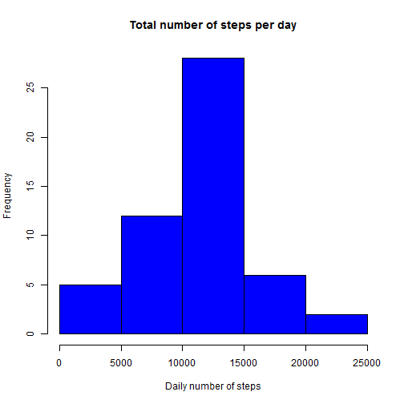
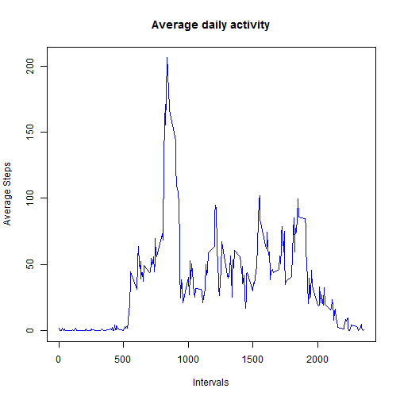
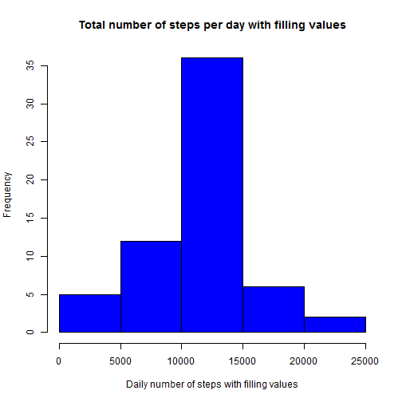
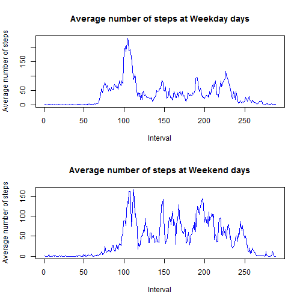

# Reproducible Research: Peer Assessment 1
This is the report for the Peer Assessment 1 at the Reproducible Research's Course at Coursera.

```
## [1] "English_United States.1252"
```


## Loading and preprocessing the data
*Show any code that is needed to load the data and process/transform the data (if necessary) into a format suitable for your analysis*

Unzip the data:

```r
unzip("activity.zip")
```

Read the activity file:

```r
activity <- read.csv("activity.csv")
```

Data summary:

```r
summary(activity)
```

```
##      steps               date          interval   
##  Min.   :  0.0   2012-10-01:  288   Min.   :   0  
##  1st Qu.:  0.0   2012-10-02:  288   1st Qu.: 589  
##  Median :  0.0   2012-10-03:  288   Median :1178  
##  Mean   : 37.4   2012-10-04:  288   Mean   :1178  
##  3rd Qu.: 12.0   2012-10-05:  288   3rd Qu.:1766  
##  Max.   :806.0   2012-10-06:  288   Max.   :2355  
##  NA's   :2304    (Other)   :15840
```

## What is mean total number of steps taken per day?

*Make a histogram of the total number of steps taken each day:*

```r
dailySteps <- tapply(activity$steps, activity$date, sum)
hist(dailySteps, main="Total number of steps per day", xlab="Daily number of steps", col="blue")
```

 

*Calculate and repor the mean and median total number of step taken per day:*

```r
mean <- mean(dailySteps, na.rm=TRUE)
median <- median(dailySteps, na.rm=TRUE)
```

The mean total number of steps taken per day is 1.0766 &times; 10<sup>4</sup> and the median total number of steps taken per day is 10765.

## What is the average daily activity pattern?

*Make a time series plot of the 5-minute interval (x-axis) and the average number of steps taken, averaged across all days (y-axis):*

```r
averageDaily <- aggregate(x=list(steps=activity$steps), by=list(interval=activity$interval), mean, na.rm=TRUE)
plot(steps ~ interval, data=averageDaily, xlab="Intervals", ylab="Average Steps", main="Average daily activity",type="l",col="blue")
```

 

*Which 5-minute interval, on average across all the days in the dataset, contains the maximum number of steps?:*


```r
max_ave_daily <- averageDaily[which(averageDaily$steps==max(averageDaily$steps)),1]
```

The interval which contains the maximum number of steps is 835.

## Imputing missing values

*Calculate and report the total number of missing values in the dataset (i.e. the total number of rows with NAs)*


```r
missing <- is.na(activity$steps)
missingSum <- sum(missing)
```

The total number of missing values in the dataset is 2304.

*Devise a strategy for filling in all of the missing values in the dataset. The strategy does not need to be sophisticated. For example, you could use the mean/median for that day, or the mean for that 5-minute interval, etc.*

The strategy is filling the missing values with the mean for that 5-minutes interval.

*Create a new dataset that is equal to the original dataset but with the missing data filled in.*


```r
newdata <- activity
missingD <- newdata$interval[missing]
filled <- numeric()
for(id in 1:nrow(averageDaily)){
  filled[missingD %in% averageDaily$interval[id]] <- averageDaily$steps[id]
}
newdata$steps[missing] <- filled
```

*Make a histogram of the total number of steps taken each day and Calculate and report the mean and median total number of steps taken per day. Do these values differ from the estimates from the first part of the assignment? What is the impact of imputing missing data on the estimates of the total daily number of steps?*

```r
newDailySteps <- tapply(newdata$steps, newdata$date, sum)
hist(newDailySteps, main="Total number of steps per day with filling values", xlab="Daily number of steps with filling values", col="blue")
```

 

## Are there differences in activity patterns between weekdays and weekends?
*Create a new factor variable in the dataset with two levels - "weekday" and "weekend" indicating whether a given date is a weekday or weekend day.*


```r
day <- weekdays(as.Date(newdata$date))
newdata$days <- ifelse(day %in% c("Saturday", "Sunday"), "Weekend","Weekday")
newdata$days <- as.factor(newdata$days)
```

*Make a panel plot containing a time series plot (i.e. type = "l") of the 5-minute interval (x-axis) and the average number of steps taken, averaged across all weekday days or weekend days (y-axis). The plot should look something like the following, which was creating using simulated data:*


```r
par(mfrow=c(2,1))
weekdays <- newdata[newdata$days=="Weekday",]
weekdaysMean <- tapply(weekdays$steps, weekdays$interval, mean)
plot(weekdaysMean, main="Average number of steps at Weekday days", xlab="Interval",ylab="Average number of steps",type="l",col="blue")
weekends <- newdata[newdata$days=="Weekend",]
weekendsMean <- tapply(weekends$steps, weekends$interval, mean)
plot(weekendsMean, main="Average number of steps at Weekend days", xlab="Interval",ylab="Average number of steps",type="l",col="blue")
```

 

